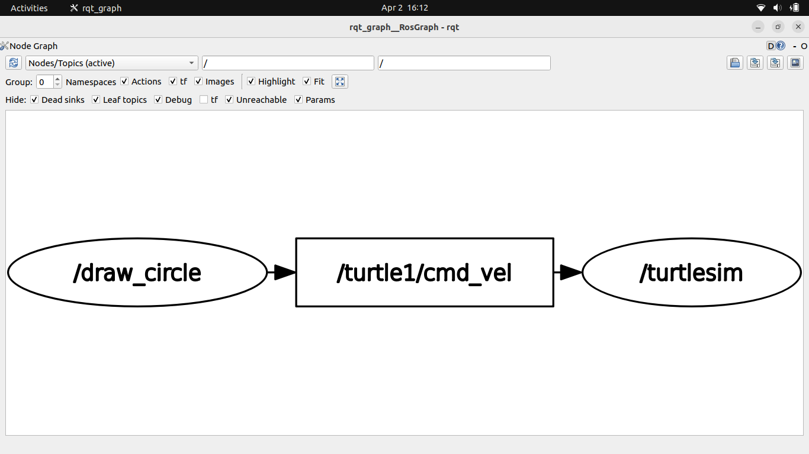
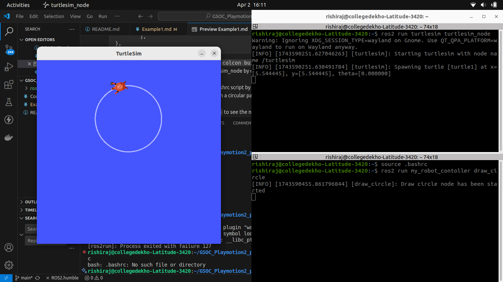
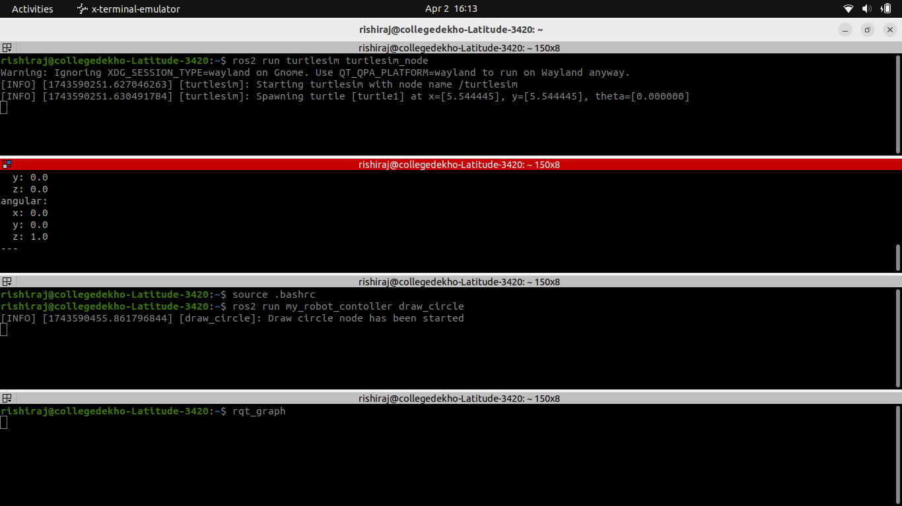
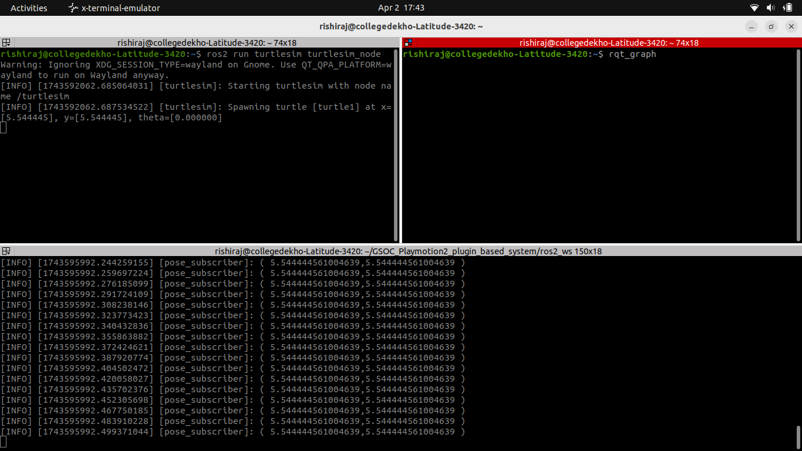
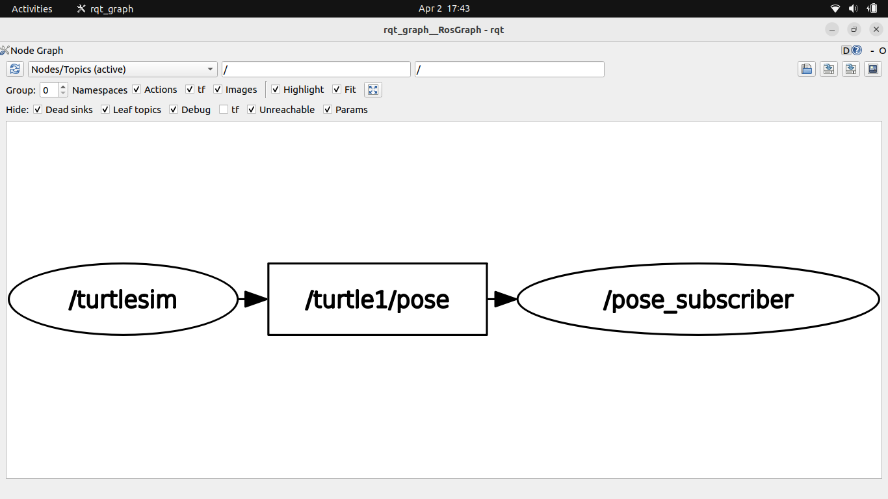
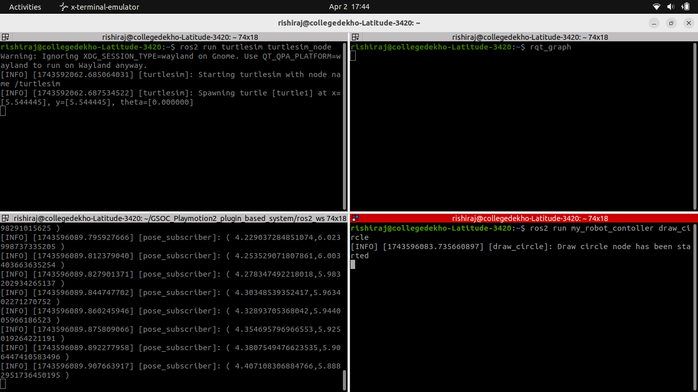
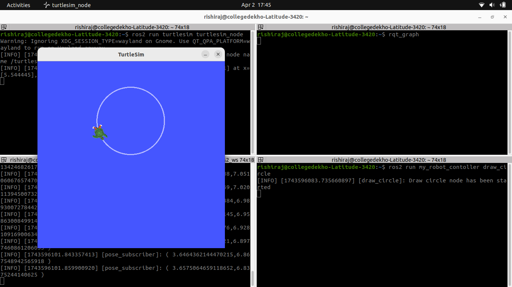
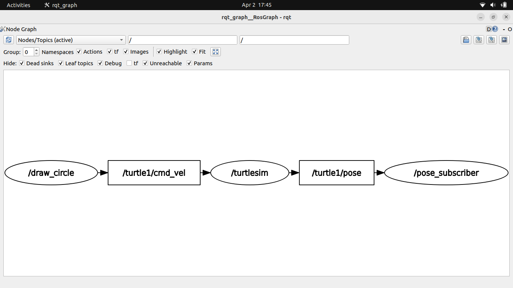

# AIM: To Execute a basic example of publish / subscribe in ROS 2 Humble.

## Setup steps
### Writing a ROS2 Publisher with Python
- Move to path my_robot_contoller by using cd command
`ros2_ws/src/my_robot_contoller/my_robot_contoller`
- Run the following commands:
``` touch draw_circle.py  ``` and  then
``` chmod +x draw_circle.py```
- Move to src 
``` cd ../.. ```
- Add the following code to draw_circle.py
```#! /usr/bin/env python3
import rclpy 
from rclpy.node import Node
from geometry_msgs.msg import Twist

class DrawCircleNode(Node):
    def __init__(self):
        super().__init__("draw_circle")
        self.cmv_vel_pub_= self.create_publisher(Twist,"/turtle1/cmd_vel",10) #queue size
        self.get_logger().info("Draw circle node has been started")
        self.timer_=self.create_timer(0.5,self.send_velocity_command)
    def send_velocity_command(self):
        msg=Twist()
        msg.linear.x=2.0
        msg.angular.z=1.0
        self.cmv_vel_pub_.publish(msg)

def main(args=None):
    rclpy.init(args=args)
    node=DrawCircleNode()
    rclpy.spin(node)
    rclpy.shutdown()
 ```
- Add the dependecies in package.xml or simply copy the following code with all the req dependecies added:
``` <?xml version="1.0"?>
<?xml-model href="http://download.ros.org/schema/package_format3.xsd" schematypens="http://www.w3.org/2001/XMLSchema"?>
<package format="3">
  <name>my_robot_contoller</name>
  <version>0.0.0</version>
  <description>TODO: Package description</description>
  <maintainer email="211220044@nitdelhi.ac.in">rishiraj</maintainer>
  <license>TODO: License declaration</license>

  <depend>rclpy</depend>
  <depend>geometry_msgs</depend>
  <depend>turtlesim</depend>

  <test_depend>ament_copyright</test_depend>
  <test_depend>ament_flake8</test_depend>
  <test_depend>ament_pep257</test_depend>
  <test_depend>python3-pytest</test_depend>

  <export>
    <build_type>ament_python</build_type>
  </export>
</package>
```

- Add these lines to setup.py 
``` 
entry_points={
        'console_scripts': [
            "test_node=my_robot_contoller.my_first_node:main",
            "draw_circle=my_robot_contoller.draw_circle:main",
        ],
}, 
```
- Move to `ros2_ws` and run the command `colcon build --symlink-install`
- Open another terminal and run the turtlesim_node by command `ros2 run turtlesim turtlesim_node`
- Open another terminal and source the bashrc script by `source .bashrc`
- run the script draw_circle to move turtle in a circular path `ros2 run my_robot_contoller draw_circle`.
- Open a new terminal and run  `rqt_graph` to see the nodes and graph for the process.
---
RQT_GRAPH

TURTLESIM

Publisher_terminal


### Writing a ROS2 Subscriber with Python
- Open a new terminal and open a turtlesim_node on it by running the command `ros2 run turtlesim turtlesim_node`
- In other terminal ,run `ros2 topic list` to see all the topics currently running in ros2
- Run `ros2 topic echo /turtle1/pose`
- Run  `ros2 topic info /turtle1/pose` to get info about subscribers and publishers related to topic
 we will get ,
 ``` 
 Type: turtlesim/msg/Pose
Publisher count: 1
Subscription count: 0
 ```
- To check the interface info ,we can run `ros2 interface show turtlesim/msg/Pose` 
```
float32 x
float32 y
float32 theta

float32 linear_velocity
float32 angular_velocity
```
- Move to the directory `ros2_ws/src/my_robot_contoller/my_robot_contoller` by using command `cd ros2_ws/src/my_robot_contoller/my_robot_contoller` at base of this project
-create a new subscriber by using command `touch pose_subscriber.py` and activate it by using `chmod +x pose_subscriber.py`
- Go back to src repo by using `cd ../..`
- Update pose_subscriber with the following code :
```
#!/usr/bin/env python3

import rclpy
from rclpy.node import Node
from turtlesim.msg import Pose

class PoseSubscriberNode(Node):
    def __init__(self):
        super().__init__("pose_subscriber")
        self.pose_subscriber = self.create_subscription(Pose, "/turtle1/pose", self.pose_callback, 10)

    def pose_callback(self, msg: Pose):
        self.get_logger().info("( "+str(msg.x)+","+str(msg.y)+" )")

def main(args=None):
    rclpy.init(args=args)
    node = PoseSubscriberNode()
    rclpy.spin(node)
    rclpy.shutdown()
```
- add this line `"pose_subscriber = my_robot_contoller.pose_subscriber:main",` inside console_scripts in `setup.py` file 
- Now , go to ros2_ws and run the command `colcon build --symlink-install`
- Now source the env by using `source ~/.bashrc`
- Now run the command `ros2 run my_robot_contoller pose_subscriber`
Now, we must get the following output



- To make subscriber and publisher both running , run the command `ros2 run my_robot_contoller draw_circle`
- Now we will get the following ouptut :


